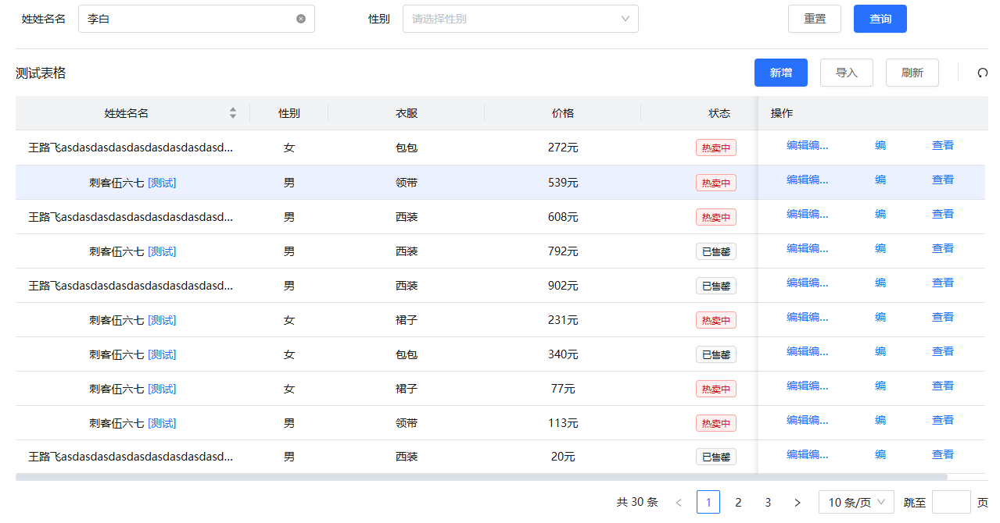
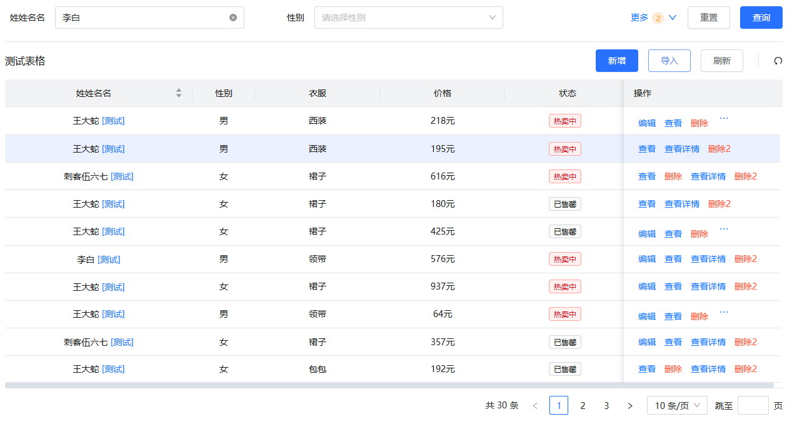
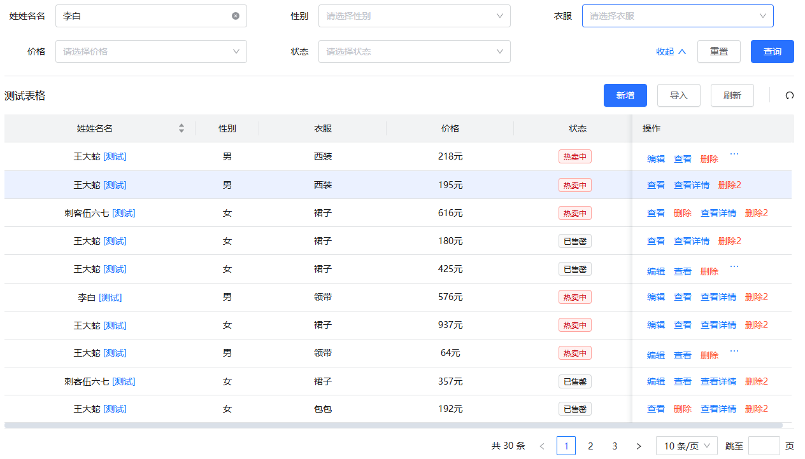

# Table 表格组件

Table 组件提供了高级表格展示功能，支持分页、排序、搜索等特性。  
自动请求，额外参数，flex布局table高度自适应，操作列的封装，toolbar 和 title显示。  
插槽支持自定义渲染，自定义样式，自定义操作列，自定义分页，自定义搜索，自定义排序。  
以及行的拖拽排序和 table 的纵向虚拟滚动等功能。

## 基本用法

下面是一个基本示例：


表单搜索



一行代码开启表头搜索(headerSearchComponent 设为 Input 或者 Checkbox)

```js
{
    title: '价格',
    align: 'center',
    // hideInSearch: true,
    headerSearchComponent: 'Input',
    dataIndex: 'price',
    formItemProps: {
      component: 'Select',
    },
    customRender: ({ record }) => `${record.price}元`,
  },
```


<demo vue="ui/table/basic.vue" />

## API

### Props

| 参数                         | 说明                                              | 类型                 | 默认值 |
| ---------------------------- | ------------------------------------------------- | -------------------- | ------ |
| AntV 的左右 table 参数都支持 | [参考链接](https://antdv.com/components/table-cn) | -                    | -      |
| columns                      | 表格列配置                                        | `Array<TableColumn>` | []     |
| search                       | 是否显示搜索表单                                  | Boolean              | true   |
| formProps                    | 表单属性配置                                      | FormProps            | {}     |
| dataRequest                  | 表格数据请求函数                                  | Function             |        |
| showIndex                    | 是否显示索引号                                    | Boolean              | false  |
| indexColumnProps             | 索引列属性配置                                    | TableColumn          | {}     |
| showToolBar                  | 是否显示表格工具栏                                | Boolean              | true   |
| showTableSetting             | 是否显示表格设置                                  | Boolean              | true   |
| headerTitle                  | 表格标题                                          | String               | -      |
| titleTooltip                 | 表格标题提示信息                                  | String               | -      |
| showRefresh                  | 是否显示刷新按钮                                  | Boolean              | false  |
| isSelect                     | / 是否支持选中                                    | Boolean              | false  |
| isMultipleSelect             | 是否支持多选                                      | Boolean              | false  |
| showSearchBorder             | 是否显示表格搜索下的 border                       | Boolean              | true   |
| isExtraParamsChangeQuery     | 额外参数改变是否立刻触发查询                      | Boolean              | true   |
| extraParams                  | 表格额外参数                                      | Object               | {}     |
| maxActionCount               | 操作列最大按钮数， 超出用 ... 显示                | Number               | 4      |
| pageSizeChangeToFirst        | 切换 pageSize 是否回到第一页                      | Boolean              | false  |
| virtualScroll                | 是否开启纵向虚拟滚动                              | Boolean              | false  |
| dragSort                     | 是否开启拖拽排序功能                              | Boolean              | false  |

### TableColumn 参数

| 参数                       | 说明                                           | 类型                                                                       | 默认值 |
| -------------------------- | ---------------------------------------------- | -------------------------------------------------------------------------- | ------ |
| dataIndex                  | 和 AntV 一样                                   | -                                                                          | -      |
| searchField                | 指定搜索的字段                                 | string                                                                     | -      |
| hideInSearch               | 在查询表单中不展示此项                         | boolean                                                                    | -      |
| hideInTable                | 在 Table 中不展示此列                          | boolean                                                                    | -      |
| formItemProps              | 传递给搜索表单 Form.Item 的配置,可以配置 rules | `Partial<FormSchema<T>>`                                                   | -      |
| headerSearchComponent      | 表头搜索组件                                   | string                                                                     | -      |
| headerSearchComponentProps | 表头搜索组件属性                               | Recordable                                                                 | -      |
| actions                    | 操作列，一般用于对表格某一行数据进行操作       | `(params: CustomRenderParams<T>, action: TableActionType) => ActionItem[]` | -      |
| children                   | children                                       | `TableColumn<T>[]`                                                         | -      |

### Methods

| 方法            | 说明                                                                          | 参数                                                    | 返回值       |
| --------------- | ----------------------------------------------------------------------------- | ------------------------------------------------------- | ------------ |
| fetchData       | 拉取表格数据                                                                  | params, reset(table change时间的参数一致)               | Promise      |
| refresh         | 刷新表格数据                                                                  | void                                                    | void         |
| getQueryFormRef | 获取查询表单实例                                                              | void                                                    | FormInstance |
| reRenderTable   | 重新渲染表格                                                                  | void                                                    | void         |
| getTableData    | 获取表格数据                                                                  | void                                                    | T[]          |
| updateTableData | 更新表格数据                                                                  | data: T[]                                               | void         |
| addColumn       | 添加 column, 在 dataIndex 之前 columns 添加， 如果没有 dataIndex 则添加到最后 | column: TableColumn \| TableColumn[], dataIndex: string | void         |
| removeColumn    | 移除 column                                                                   | dataIndex: string \| string[]                           | void         |
| updateColumn    | 更新 column                                                                   | column: TableColumn \| TableColumn[]                    | void         |
| replaceColumn   | 替换 column                                                                   | column: TableColumn \| TableColumn[]                    | void         |

### 插槽

支持自定义渲染的插槽，允许用户根据需求自定义表格的某些部分。

| 名称        | 说明                |
| ----------- | ------------------- |
| Form的slot  | Form 组件支持的插槽 |
| headerTitle | 表格标题            |
| toolbar     | 表格工具栏          |
